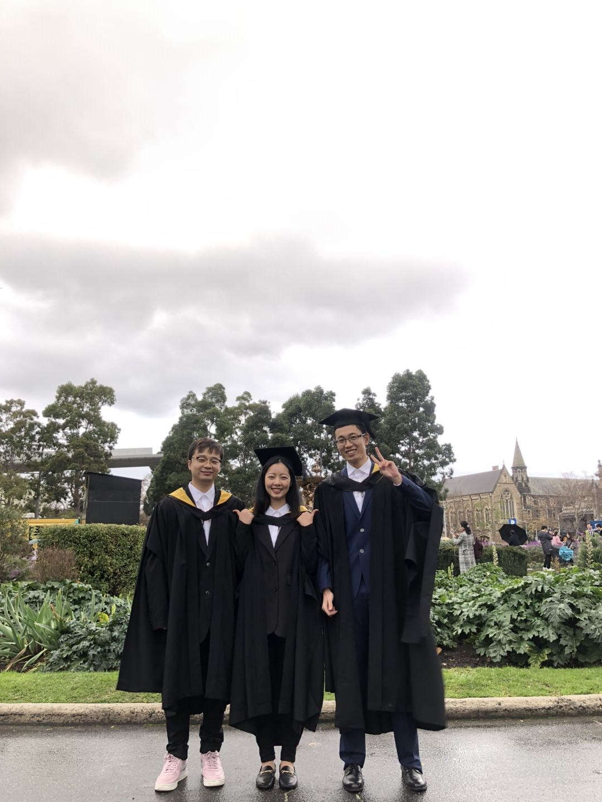

# 
 Ahoy! [Portfolio?](https://alexzhengdev.netlify.app/)

  
  
  

## I'm ... 

### 📜 Interested in both Front-end and Back-end development!

<!-- ### 🌱 Learning [ WebAssembly](https://webassembly.org/) recently~ -->

### 🌱 Learning [ GraphQL](https://graphql.org/) recently~

### 💞️ Looking to collaborate on [ReactWidgets](https://github.com/HanwenZheng/ReactWidgets)

### 📫 Contact me at: alex.zhenghw@gmail.com

## TL ; DR  

## My Skill Set  
<table><tr><td valign="top" width="45%">

### Frontend  

  
  
  
  
  
  
  
  
  
  

</td><td valign="top" width="45%">

### Backend  

  
  
  
  

 

</td></tr></table>  

<!---
## Connect with me  

 

--->

<!---
HanwenZheng/HanwenZheng is a ✨ special ✨ repository because its `README.md` (this file) appears on your GitHub profile.
You can click the Preview link to take a look at your changes.
--->
